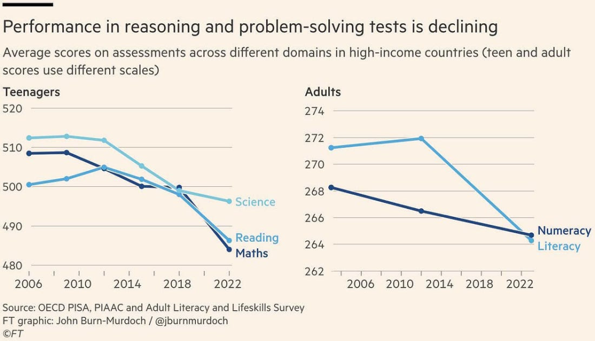
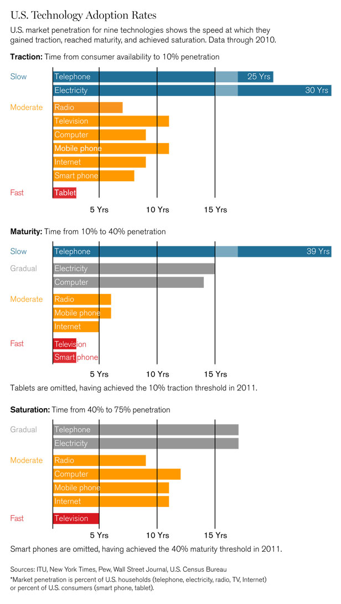
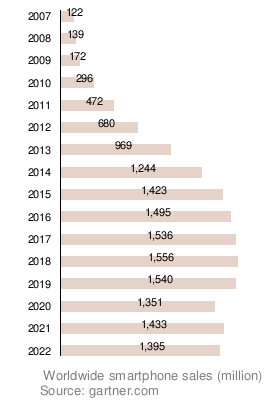
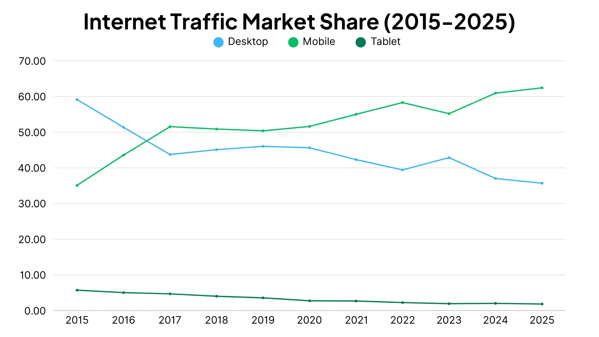
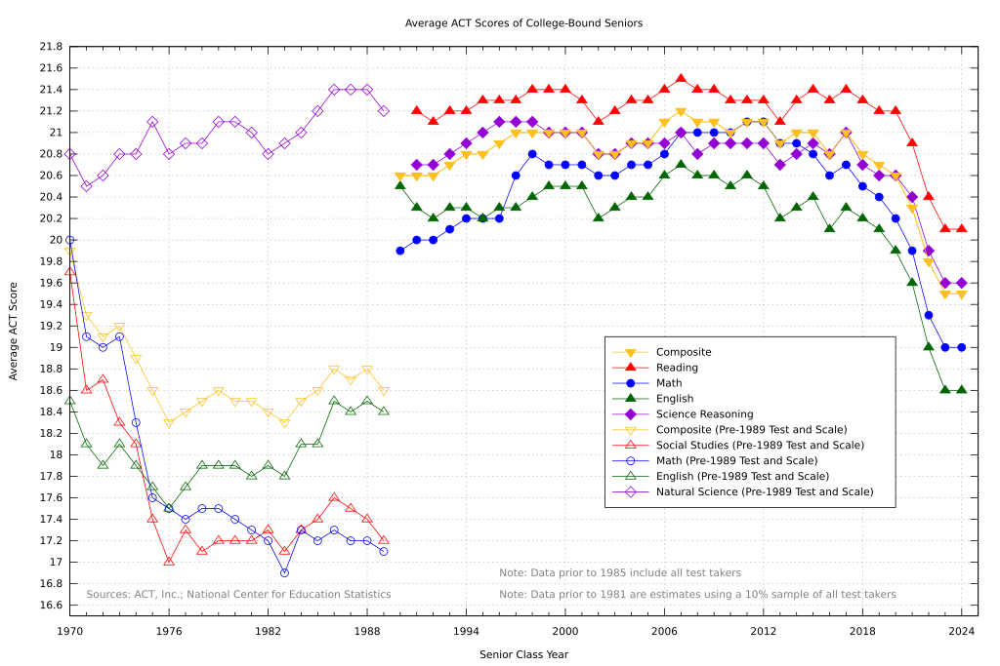
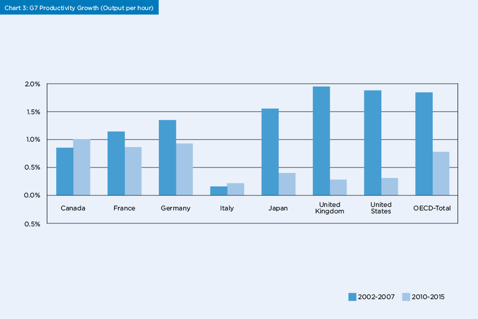
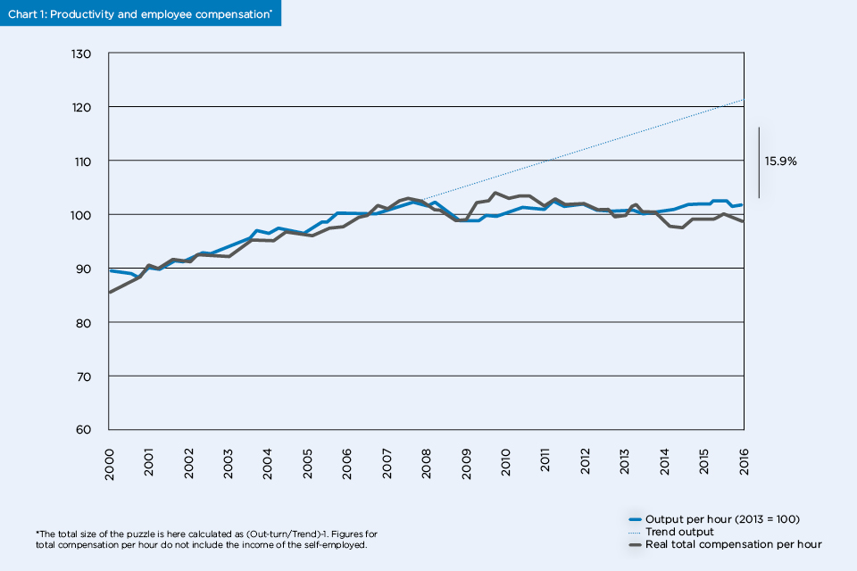
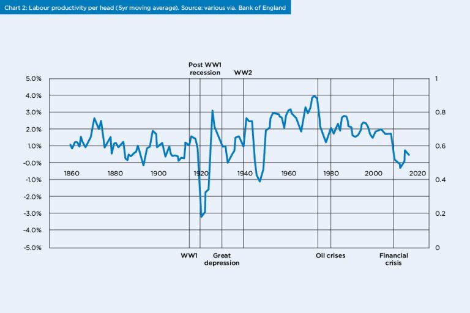
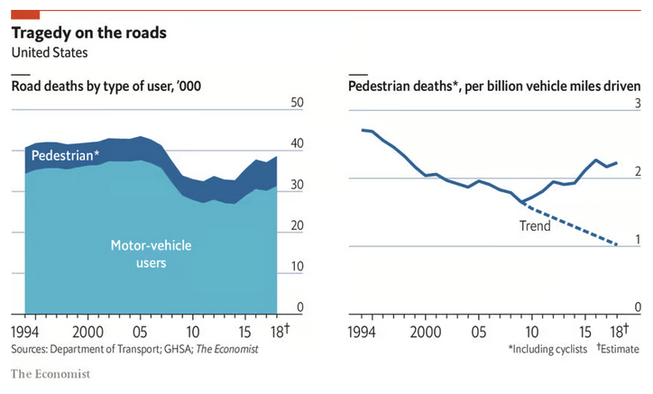

#+TITLE: What happened in 2007?
#+AUTHOR: Adam Fallon
#+STARTUP: inlineimages

* It's the damn phones!
Inspired by [[https://wtfhappenedin1971.com][WTF Happened in 1971]] I wanted to make a website detailing many charts that show something weird is happening.

Beginning around the late 2000s and accelerating through the 2010s, a series of troubling trends emerged. Measures of well-being, including happiness and life satisfaction, began to show signs of strain. Youth mental health entered a state of crisis, with rates of depression, anxiety, and self-harm rising to unprecedented levels. Concurrently, metrics of cognitive performance and academic achievement, such as international test scores and measures of fluid intelligence, appeared to stagnate or decline after decades of progress. Labour productivity growth, a cornerstone of economic prosperity, slowed to a crawl.

We had many major events in that time including the Great Recession and COVID-19 that had an large impact, but my hypothesis is that the introduction of the iPhone, and thus the modern mobile age is causing a huge impact on attention and is limiting life outcomes of millions around the globe.

This is not an attempt to say these trends are monocausal - it is worth remembering that Correlation != Causation - but it is at the very minimum interesting that the charts seem to line up around 2007, and increase in magnitude of upward or downward slope as adoption of smartphones increase.

#+BEGIN_QUOTE
If you have some interesting charts in the same vein, please feel free to open a PR [[https://github.com/afallon02/whathappenedin2007][here]] or email me at 2007@adamfallon.com

If you are interested in doing research in this area, would love to speak!

You can find me here:
- adam@adamfallon.com / 2007@adamfallon.com
- https://x.com/afallon02
- https://www.linkedin.com/in/adam-fallon-4bb4b1300/
#+END_QUOTE

This is a work in progress. I want the arguement to get strong over time, it is probably a little weaker than it should be right now, but I think it's obvious _something_ interesting has happened since 2007.

* Update Log
***** 2025-10-19-15-39 - Add Road Traffic Accidents

* IQ Scores
The "reverse Flynn effect" refers to a recent decline or plateau in average IQ scores in some developed countries, contrasting with the historical rise in IQ scores known as the Flynn effect. This trend, sometimes called the negative Flynn effect, is attributed to factors like changes in education, lifestyle shifts such as increased screen time, and other environmental influences
#+NAME: fig:reverse-flynn
#+CAPTION: Reverse Flynn Effect 

* Increase in smartphone adoption
Smartphones achieved market saturation much faster than technologies before it.

#+NAME: fig:tech-adoption
#+CAPTION: Technology Adoption Rates

By 2014 there was over a billion smart phone devices.

From 2014 to 2024 that number increased to 4.88 billion (source: https://www.bankmycell.com/blog/how-many-phones-are-in-the-world)

#+NAME: fig:tech-adoption-2
#+CAPTION: Technology Adoption Rates
file:imgs/tech_adoption_rates_2.webp

Around 60% of the world's population has a smartphone.
In some markets smartphone adoption is at 82.2% - which is to say, these devices are ubiquitous and especially so in advanced nations.

#+NAME: fig:smartphone-sales
#+CAPTION: SmartPhone Sales

Internet traffic is now primarily coming from mobile devices. It took a while for this to flip, but the act of 'Going online' went from one where you sat at a desktop, to one of being constantly online, connected 24/7/365
#+NAME: fig:internet-traffic
#+CAPTION: Traffic Trends over time

* Test Scores
#+NAME: fig:act-scores
#+CAPTION: ACT Scores 

#+NAME: fig:sat-scores
#+CAPTION: SAT Scores
file:imgs/sat_scores.jpg

* Internet Addiction
#+NAME: fig:internet-addiction
#+CAPTION: Internet Addiction
file:imgs/internet-addiction.png

* Sleep Abnormalities

Between 2010 and 2021 there was increase of self-reported sleep problems in age groups 15 to 45 of 15% (34 -> 49%).
In that time there was a 10x increase in melatonin usage (source: https://www.science.org/doi/10.1126/sciadv.adw1227)

#+NAME: fig:sleep-problems
#+CAPTION: Sleep problems
file:imgs/sleep_problems.jpg

* Youth Mental Health
One of the most concerning trends of the past 15 years is the sharp increase in internalizing disorders—chiefly depression and anxiety—among young people. This rise marks a distinct break from the relatively stable trends of the early 2000s and appears to be a widespread phenomenon across the developed world.

Young females seem to be particularily affected, with large increases in self-harming and self-reported anxiety and depression.

The ease of access to social media websites via smartphones seems to line up with these rises in behaviour.

#+NAME: fig:youth-depression
#+CAPTION: Youth Depression
file:imgs/youth_depression.png

#+NAME: fig:youth-depression-2
#+CAPTION: Youth Depression
file:imgs/youth_depression_2.png

#+NAME: fig:youth-depression-3
#+CAPTION: Youth Depression
file:imgs/youth_depression_3.png

#+NAME: fig:youth-depression-4
#+CAPTION: Youth Depression
file:imgs/youth_depression_4.png

Sources:
- https://www.anxiousgeneration.com/research/the-evidence
- https://pmc.ncbi.nlm.nih.gov/articles/PMC9176070/
- https://www.statista.com/chart/20052/share-of-us-teenagers-experiencing-depressive-episodes-and-receiving-treatment/

* Loneliness
Survey data consistently identifies young adults as the demographic most acutely affected by loneliness. One comprehensive survey found that 61% of young adults in the U.S. aged 18 to 25 identified as "seriously lonely". Globally, the figures are similarly high, with one study finding that 27% of young adults aged 19 to 29 experience feelings of loneliness. When compared generationally, the contrast is stark. One report found that 80% of Generation Z individuals (born roughly 1997-2012) reported feelings of isolation over the past year, significantly higher than the 72% of Millennials and 45% of Baby Boomers who said the same

Sources:
- https://www.magnetaba.com/blog/loneliness-statistics

* Productivity

Economic productivity, specifically labour productivity (output per hour worked), is the primary driver of long-term improvements in living standards.

After a period of growth in the late 1990s and early 2000s, Labour productivity growth is slowing following the 2007-2009 

The Great Recession and COVID are obviously huge drivers of lost productivity, but it stands to reason that if we're sleeping less, are more depressed, and have less socially active lives, our productive output will suffer in some way.

#+NAME: fig:eu-productivity-3
#+CAPTION: World Productivity 

#+NAME: fig:uk-productivity-1
#+CAPTION: UK Productivity 

#+NAME: fig:uk-productivity-2
#+CAPTION: UK Productivity 

* Road Traffic Accidents
#+NAME: fig:rta
#+CAPTION: Pedestrian Deaths Per Billion vehicle miles

Sources:
- https://www.economist.com/graphic-detail/2019/05/13/smartphones-are-driving-americans-to-distraction
#+BEGIN_QUOTE
Smartphones grab our attention so powerfully that if they merely vibrate in our pockets for a tenth of a second, many of us will interrupt a face-to-face conversation, just in case the phone is bringing us an important update. 

--- Jonathan Haidt, The Anxious Generation: How the Great Rewiring of Childhood Is Causing an Epidemic of Mental Illness 

#+END_QUOTE

#+BEGIN_QUOTE
Do you think the same thing - smartphones are driving detrimental trends across the world?

Get in touch:

If you have some interesting charts in the same vein, please feel free to open a PR [[https://github.com/afallon02/whathappenedin2007][here]] or email me at 2007@adamfallon.com

If you are interested in doing research in this area, would love to speak!

You can find me here:
- adam@adamfallon.com / 2007@adamfallon.com
- https://x.com/afallon02
- https://www.linkedin.com/in/adam-fallon-4bb4b1300/
#+END_QUOTE
